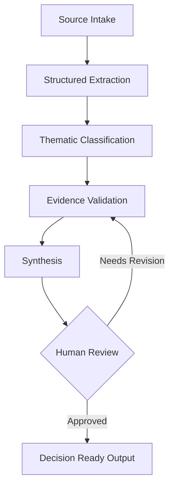

# Workflow Architecture

The workflow separates research into stages so each step can be inspected, validated, and improved independently. This diagram describes the workflow design; it does not imply an automated implementation.

## Why this structure

Extraction preserves evidence before interpretation begins. Classification organizes evidence into themes; validation checks claims against sources before synthesis turns them into a usable brief. Separate stages make errors easier to locate and correct.

## Human judgment gate

A person checks source support, conflicts, missing context, and conclusions. Weak or inconsistent evidence returns to validation, followed by an updated synthesis and another review. Approval means the output is suitable for its stated purpose; unresolved questions remain visible.
